# دليل المدير — مطبعة المصطفى

كل ما في [دليل الموظف](staff.md) متاح لك أيضاً. هنا ما يخصّك وحدك. الصور لقطات حقيقية من التطبيق.

## أول يوم: التجهيز بالترتيب

1. **بيانات المحل على الموقع**: من **الموقع ← بيانات المحل**: العنوان، والبريد، والهاتف، وواتساب، وساعات العمل. هذه تظهر في الموقع وفي صفحتي الخصوصية والشروط.
2. **الاسم الرسمي والضريبة**: من **الإعدادات ← الطاقم ← الإعدادات** (الصورة أدناه).
3. **الموظفون**: من **الطاقم ← إضافة عضو**.
4. **المنتجات والأسعار**: من **المنتجات**، منتجاً منتجاً — أو دفعة واحدة من ملف Excel/CSV إن كانت لديك قائمة جاهزة (التالي).

## استيراد المنتجات والمخزون من ملف

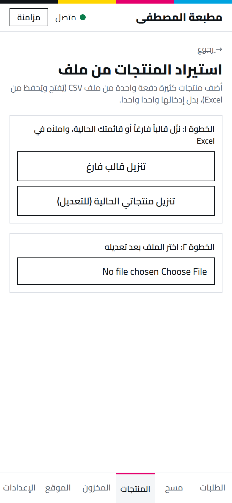

من **المنتجات ← استيراد من ملف** (وكذلك **المخزون ← استيراد من ملف**):

1. **نزّل قالباً فارغاً**، أو **قائمتك الحالية** إن أضفتَ منتجات من قبل وتريد تعديلها بالجملة.
2. املأه في Excel: **رمز** فريد لكل منتج، الاسم بالعربية والإنجليزية، والسعر. اترك أي خانة أخرى فارغة إن لم تكن جاهزاً؛ **الخانة الفارغة لا تمسح شيئاً** عند إعادة الاستيراد، بل تُبقي القيمة كما هي.
3. **اختر الملف** بعد حفظه. تعرض الشاشة كل صف: صحيح (سيُستورد) أو فيه خطأ (لن يُستورد حتى تصحّحه). منتج برمز موجود مسبقاً يُحدَّث، لا يتكرر.
4. **استيراد** لتأكيد الدفعة. يُرسَل عند عودة الاتصال كأي تعديل آخر.

المخزون له عمود إضافي: **رصيد البداية** — الكمية التي لديك الآن فعلاً. يُطبَّق مرة واحدة فقط عند إنشاء المادة أول مرة؛ إعادة الاستيراد لتحديث السعر لا تضيف الكمية مجدداً.

## الإعدادات

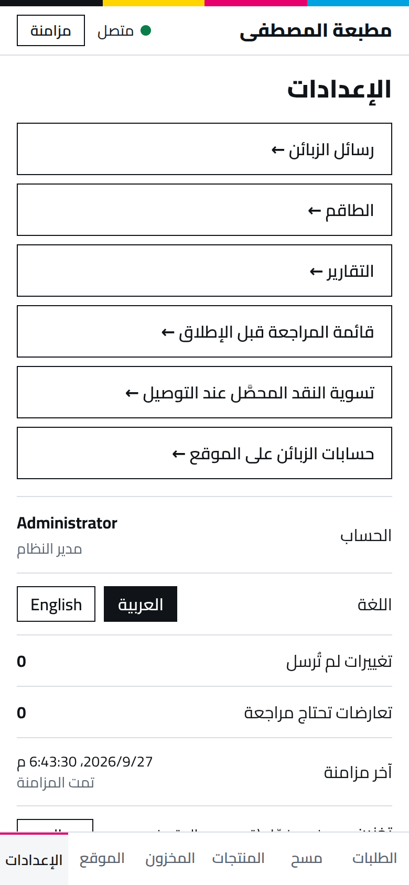

من هنا تصل إلى: **رسائل الزبائن**، و**الطاقم**، و**التقارير**، و**تسوية نقد المناديب**، و**حسابات الزبائن على الموقع**.

## الطاقم

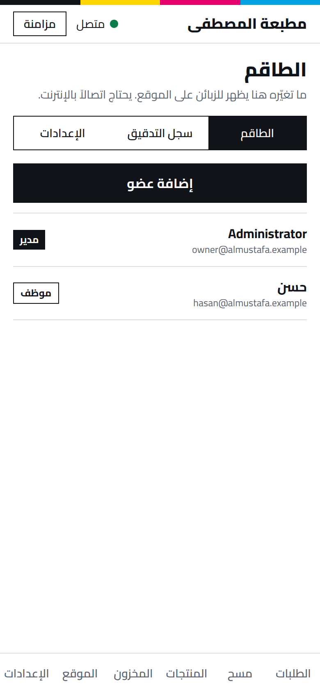

- **إضافة عضو**: الاسم والبريد أو الهاتف وكلمة مرور أولى، والدور: **مدير** أو **موظف**.
- اضغط على موظف لتعديله أو تعطيله، أو **إعادة تعيين كلمة السر**، أو **إنهاء الجلسات على كل الأجهزة** فوراً (إن فُقد هاتفه مثلاً)، أو منحه **صلاحيات إضافية** محددة (كالإلغاء أو تجاوز سقف الخصم).
- **سجل التدقيق**: من فعل ماذا ومتى في كل إجراء حساس. لا يُعدَّل ولا يُحذف.

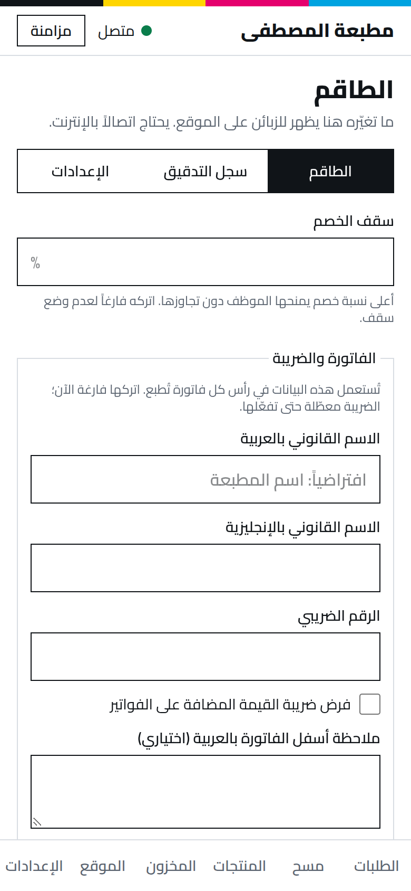

- **سقف الخصم**: أعلى نسبة خصم يمنحها الموظف دون موافقتك. فارغ = بلا سقف.
- **الفاتورة والضريبة**: **الاسم القانوني بالعربية** يظهر على الفواتير **وفي صفحتي الخصوصية والشروط**، والرقم الضريبي، و**فرض ضريبة القيمة المضافة** ونسبتها (معطّلة حتى يقرر محاسبك)، وملاحظة أسفل الفاتورة.
- **العربون**: نسبة تُدفع قبل الطباعة، ومن أي قيمة طلب. 0 = معطّل.

## التقارير

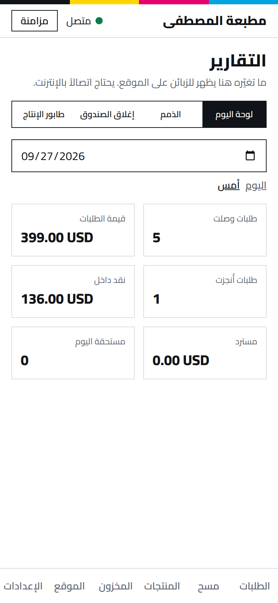

- **لوحة اليوم**: طلبات وصلت وقيمتها، وما أُنجز، والنقد الداخل، والمسترد. غيّر التاريخ لترى يوماً آخر.
- **الذمم**: كل طلب لم يُدفع كاملاً والمتبقي عليه.
- **إغلاق الصندوق**: النقد حسب الطريقة لتاريخ تختاره، لمطابقة الدرج آخر النهار.
- **طابور الإنتاج**: ما لم يُسلَّم بعد، الأقرب موعداً أولاً، والمتأخر مميَّز.

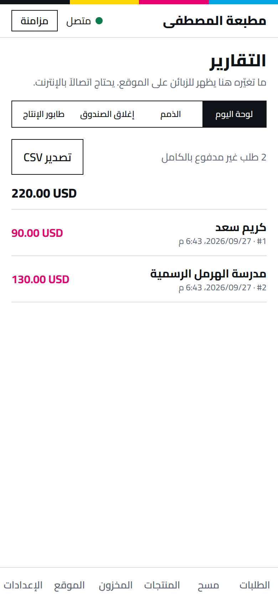

كل تقرير له **تصدير CSV** يُفتح في Excel.

## المنتجات والأسعار

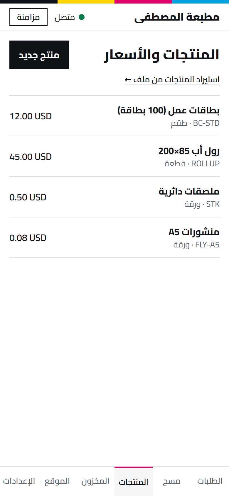

**منتج جديد**: الرمز، والاسم بالعربية والإنجليزية، والوحدة، والسعر، وأسعار الكميات إن وُجدت. قسم **«على الموقع»** يقرر ظهوره للزبائن مع وصفه وصورته والخدمة المرتبطة به.

## الموقع الإلكتروني

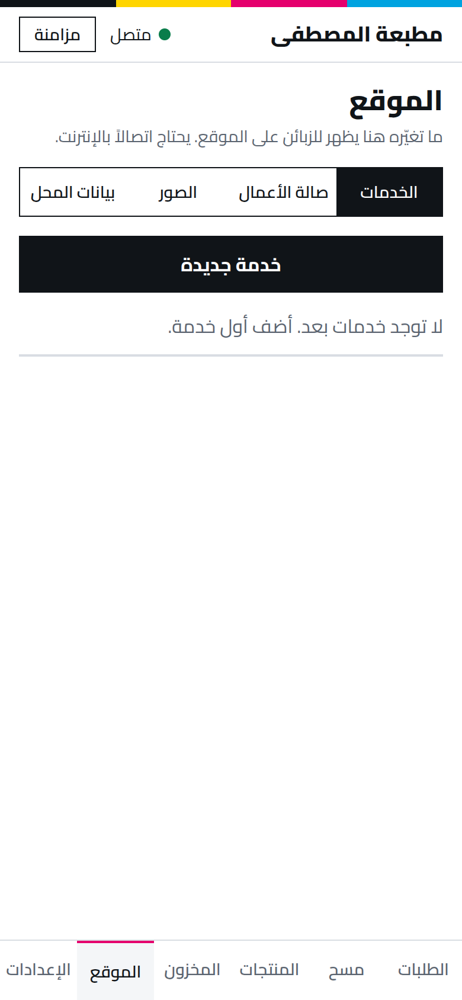

**الخدمات** · **صالة الأعمال** · **الصور** · **بيانات المحل**. كل صورة تحتاج **وصفاً** قبل نشرها (لقارئات الشاشة ومحركات البحث)، والتطبيق يرفض نشرها دونه.

## رسائل الزبائن

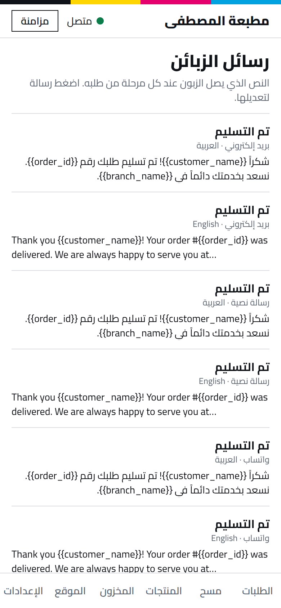

النص الذي يصل الزبون عند كل مرحلة من طلبه، لكل وسيلة ولغة. اضغط رسالة لتعديلها. الكلمات بين `{{ }}` تُستبدل تلقائياً (اسم الزبون، رقم الطلب، رابط التتبّع). **لا تحذفها.**

## تسوية النقد المحصَّل عند التوصيل

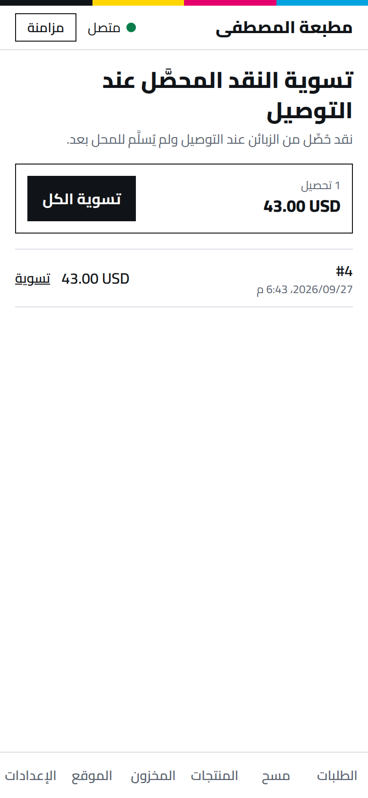

نقد حُصِّل من الزبائن عند التوصيل ولم يُسلَّم للمحل بعد، الأقدم أولاً. **سوِّ الكل** دفعة واحدة، أو كل تحصيل على حدة إن سُلِّم جزء فقط.

## قائمة المراجعة قبل الإطلاق

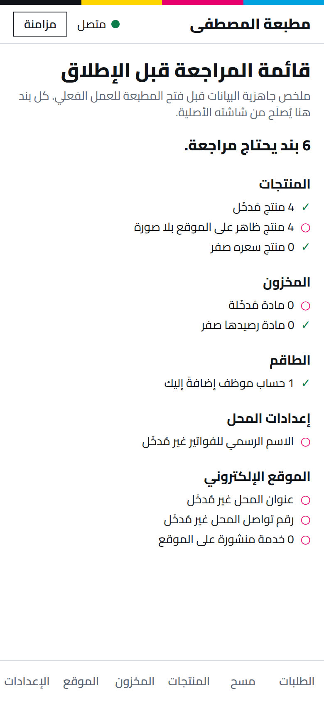

من **الإعدادات ← قائمة المراجعة قبل الإطلاق**: ملخص فوري لما دخلتَه وما بقي، دون أن تتذكر بنفسك كل شاشة راجعتها. كل بند يشير إلى شاشته الأصلية للإصلاح.
راجعها قبل أول يوم عمل فعلي، ثم من وقت لآخر أثناء إدخال بياناتك.

## الملخص اليومي بالبريد

من **الإعدادات ← الطاقم ← الإعدادات** أدخل **بريدك** واختر **ساعة الإرسال** (بتوقيت المحل، والافتراضي 21:00). تصلك كل يوم رسالة واحدة: كم طلباً وردت وبأي قيمة، كم سُلِّم، النقد الداخل للصندوق، ما هو مستحق اليوم أو متأخر، والذمم غير المسدَّدة. **أفرغ خانة البريد لإيقافها.**
لا تتكرر الرسالة في اليوم نفسه حتى لو أُعيد تشغيل الخادم، وإن تعذّر الإرسال يُعاد المحاولة تلقائياً. لا تصل شيئاً حتى تُدخل بريدك أنت.

## أوامر يومية سريعة

| متى | ماذا |
|---|---|
| صباحاً | **التقارير ← طابور الإنتاج** |
| طوال اليوم | طلبات الموقع الجديدة (فعّل **التنبيه** من الإعدادات) |
| آخر النهار | **التقارير ← إغلاق الصندوق** وطابق الدرج |
| أسبوعياً | **الذمم**، ثم تواصل مع المتأخرين |
