# دليل الموظف — مطبعة المصطفى

هذا الدليل لمن يعمل على الكاونتر وفي الورشة. كل صورة هنا لقطة حقيقية من التطبيق كما يظهر على الهاتف.

## ١. الدخول لأول مرة

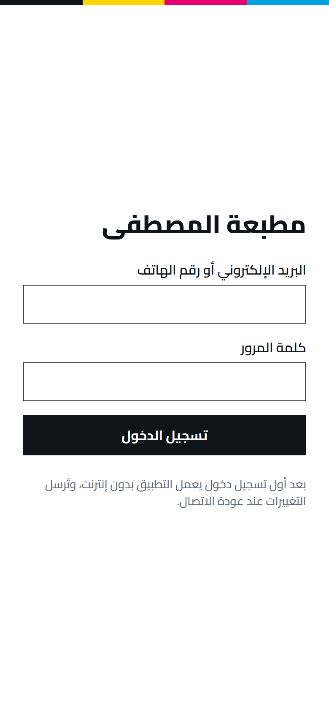

1. افتح رابط التطبيق الذي أعطاك إياه المدير.
2. اكتب **بريدك الإلكتروني أو رقم هاتفك** و**كلمة المرور**، ثم **تسجيل الدخول**.
3. من قائمة المتصفح اختر **«إضافة إلى الشاشة الرئيسية»**، فيصير التطبيق أيقونة على هاتفك كأي تطبيق.

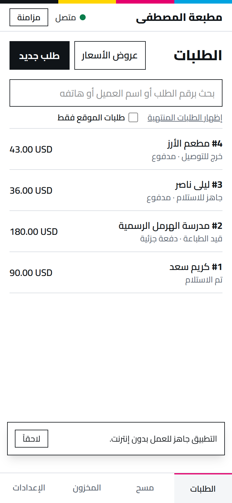

بعد أول دخول تظهر رسالة **«التطبيق جاهز للعمل بدون إنترنت»**. من هذه اللحظة، **إن انقطع الإنترنت تابع عملك كالمعتاد**: كل ما تسجّله يُحفظ على الهاتف ويُرسل وحده عند عودة الاتصال. في أعلى الشاشة ترى **«متصل»** أو غير متصل، وزر **مزامنة** إن أردت الإرسال فوراً.

## ٢. قائمة الطلبات

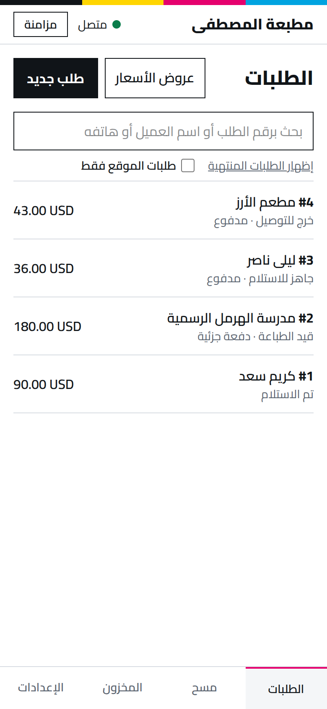

- كل طلب يظهر برقمه واسم العميل ومرحلته (مثلاً: **تم الاستلام**، **قيد الطباعة · دفعة جزئية**، **جاهز للاستلام · مدفوع**، **خرج للتوصيل**).
- ابحث **برقم الطلب أو اسم العميل أو هاتفه** من خانة البحث.
- **«طلبات الموقع فقط»** يعرض الطلبات التي وصلت من الموقع الإلكتروني.
- **«إظهار الطلبات المنتهية»** يعرض المسلَّمة والملغاة أيضاً.

## ٣. طلب جديد

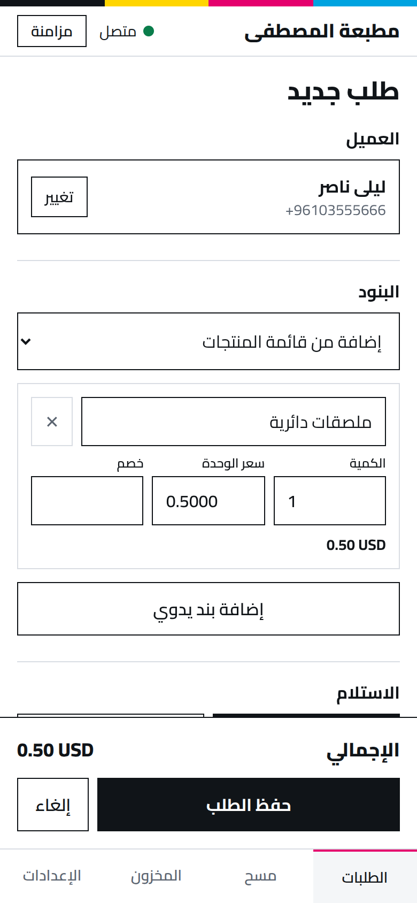

1. اضغط **طلب جديد**.
2. **العميل**: ابحث بالاسم أو الهاتف واختره. إن كان جديداً اضغط **عميل جديد** (الاسم والهاتف، وموافقته على رسائل واتساب إن وافق).
3. **البنود**: اختر من **«إضافة من قائمة المنتجات»**، فيُملأ السعر تلقائياً. أو **«إضافة بند يدوي»** لعمل خاص. عدّل **الكمية**، و**الخصم** إن وُجد.

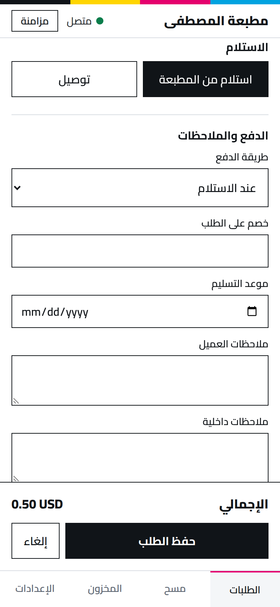

4. **الاستلام**: **استلام من المطبعة** أو **توصيل** (مع العنوان). أجرة التوصيل يحددها المدير.
5. **طريقة الدفع**، و**موعد التسليم** إن اتُّفق عليه، و**ملاحظات العميل** (تظهر له) أو **ملاحظات داخلية** (للطاقم فقط).
6. راجع **الإجمالي** ثم **حفظ الطلب**. يصل العميلَ تلقائياً إشعار باستلام طلبه إن كان موافقاً على الرسائل.

> **خصم أكبر من المسموح؟** يرفضه التطبيق ويطلب موافقة المدير. هذا مقصود.

## ٤. شاشة الطلب

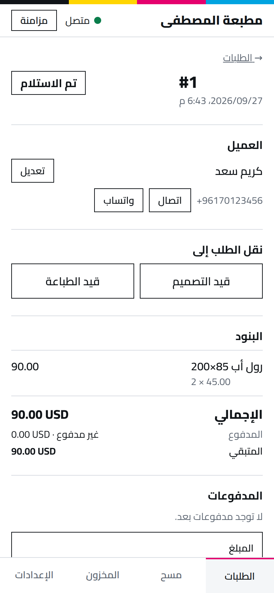

- **العميل**: **اتصال** أو **واتساب** بضغطة، و**تعديل** بياناته.
- **نقل الطلب إلى**: الأزرار تعرض المراحل التالية المسموحة فقط (مثلاً **قيد التصميم** أو **قيد الطباعة**). اضغط المرحلة الجديدة عند الانتقال إليها فعلاً.
- إن كان للطلب **عربون مطلوب** يظهر تنبيه بقيمته، ولا يُنقل إلى الطباعة قبل دفعه.

### تسجيل دفعة

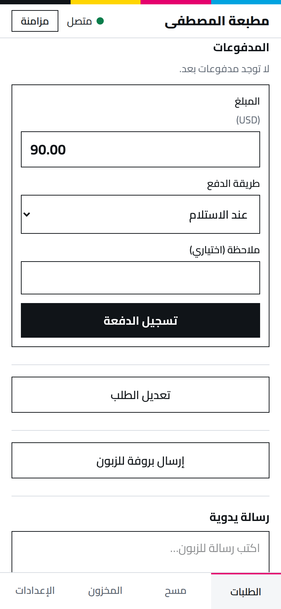

1. في **المدفوعات** يظهر **المبلغ** المتبقي جاهزاً. عدّله إن دفع العميل جزءاً فقط.
2. اختر **طريقة الدفع**، وأضف ملاحظة إن لزم.
3. **تسجيل الدفعة**. يتحدث **المدفوع** و**المتبقي** فوراً.

### أدوات أخرى في الطلب

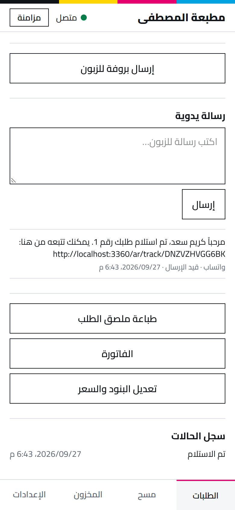

- **إرسال بروفة للزبون**: ارفع صورة أو PDF للتصميم، ثم أرسل الرابط بواتساب. حين يوافق الزبون تظهر **«وافق الزبون على البروفة»**.
- **رسالة يدوية**: اكتب رسالة للزبون وأرسلها؛ تحتها سجلّ كل ما أُرسل له.
- **طباعة ملصق الطلب** · **الفاتورة** · **تعديل البنود والسعر** (قبل بدء الطباعة أو الدفع؛ بعدها يحتاج المدير).
- **سجل الحالات**: متى انتقل الطلب من مرحلة إلى أخرى.

## ٥. الملصق والمسح

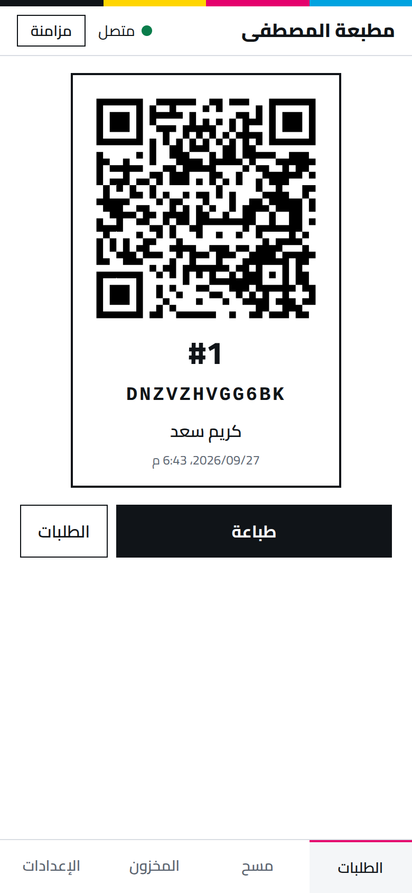

اطبع الملصق والصقه على العمل أو الكيس. عليه رمز QR ورقم الطلب واسم العميل.

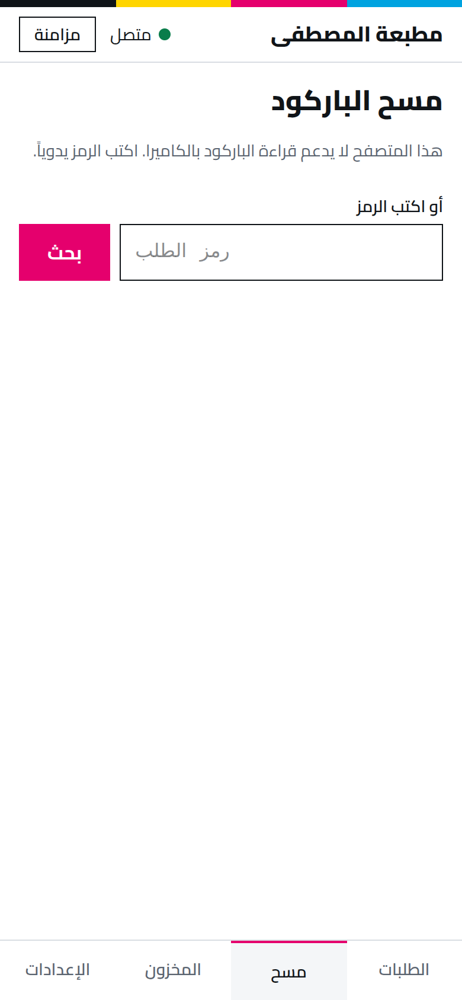

من **مسح** في الأسفل: وجّه الكاميرا إلى الملصق فيفتح الطلب مباشرة. إن لم يدعم هاتفك الكاميرا (كما في الصورة)، **اكتب الرمز** المطبوع تحت الـQR واضغط **بحث**.

## ٦. العملاء وعروض الأسعار

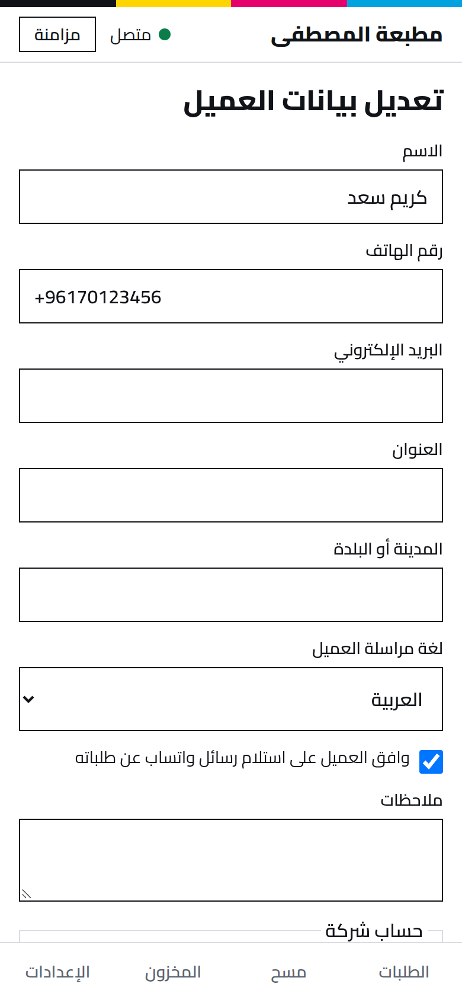

لتصحيح هاتف أو عنوان، أو تسجيل موافقة العميل على رسائل واتساب. **لا تفعّل الموافقة إلا إن وافق العميل فعلاً.**

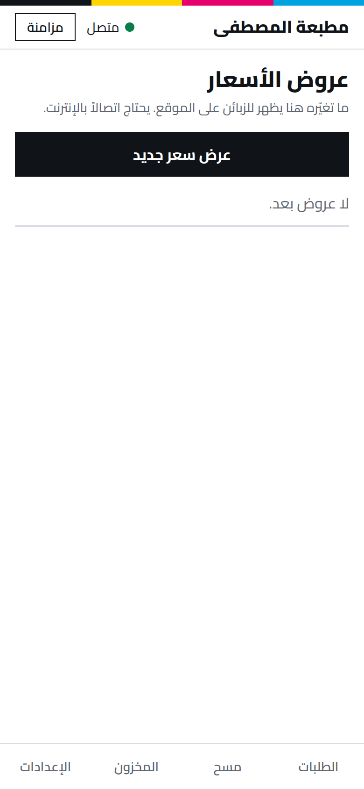

**عرض سعر جديد** (يحتاج إنترنت): تختار العميل والبنود ومدة الصلاحية، ثم ترسل الرابط بواتساب. حين يقبله العميل يصير طلباً تلقائياً بالأسعار نفسها.

## ٧. الإعدادات

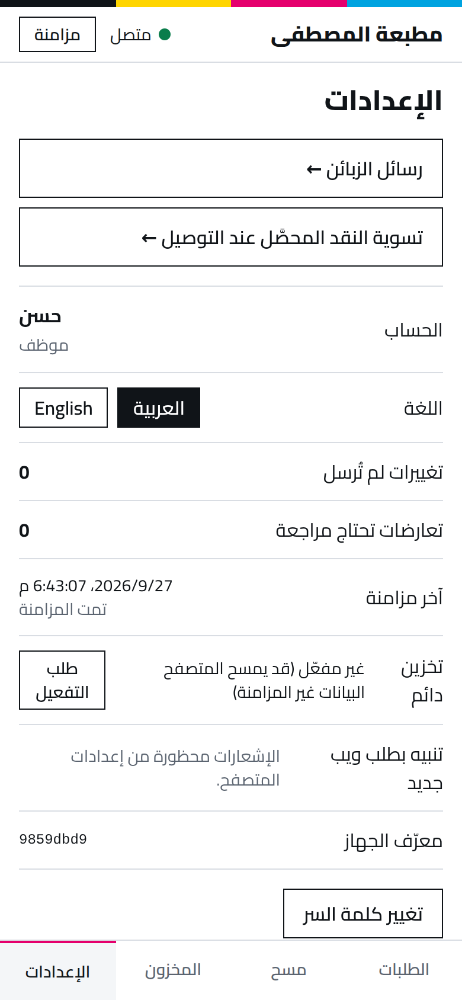

- **اللغة**: العربية أو English.
- **تغييرات لم تُرسل**: عددها يجب أن يعود **0** بعد عودة الإنترنت. إن بقي مرتفعاً طويلاً أخبر المدير.
- **تعارضات تحتاج مراجعة**: إن عدّل شخصان الشيء نفسه في الوقت نفسه. أخبر المدير.
- **تخزين دائم**: اضغط **طلب التفعيل** مرة واحدة، كي لا يمسح المتصفح بيانات لم تُرسل بعد.
- **تنبيه بطلب ويب جديد**: فعّله ليصلك إشعار حتى والتطبيق مغلق.
- **تغيير كلمة السر**.

## ما يحتاج المدير

الإلغاء، والاسترداد، والخصم فوق السقف، وتعديل طلب بدأت طباعته أو دُفع منه، وتجاوز العربون أو الحد الائتماني، وتغيير الأسعار في قائمة المنتجات.

**لا تمسح بيانات المتصفح ولا تحذف التطبيق** ما دام في «تغييرات لم تُرسل» رقم أكبر من 0.
